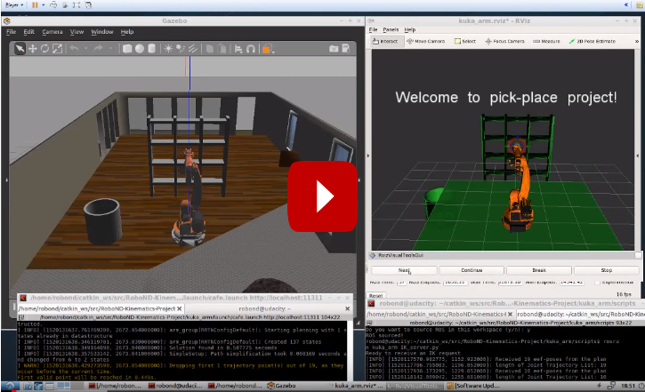

[//]: # (Image References)
[image1]: ./misc_images/misc1.png
[image2]: ./misc_images/misc2.png
[image3]: ./misc_images/misc3.png
[image4]: ./misc_images/misc4.PNG
[image5]: ./misc_images/misc5.png
[image6]: ./misc_images/misc6.png
[image7]: ./misc_images/misc7.png

## Project: Kinematics Pick & Place
![alt text][image2]
# Introduction
---
The purpose of this project was to calculate and program joint angles for a six degree of freedom kuka KR210 serial manipulator. The position and orientation of its end effector were provided in a 3-D space. This project uses a Ros environment with Gazebo simulation platform as well as Rviz MoveIt motion planning framework. The intent for the manipulator is to pick up a cylinder from a random location on a shelf and drop it into a bin next to the kuka manipulator.


### Kinematic Analysis
#### 1. Run the forward_kinematics demo and evaluate the kr210.urdf.xacro file to perform kinematic analysis of Kuka KR210 robot and derive its DH parameters.
![alt text][image6]

Reference frame assignments in URDF file:

Joint Name | Parent Link | Child Link | x(m) | y(m) | z(m)
--- | --- | --- | --- | --- | ---
joint_1 | base_link | link_1 | 0 | 0 | 0.33
joint_2 | link_1 | link_2 | 0.35 | 0 | 0.42
joint_3 | link_2 | link_3 | 0 | 0 | 1.25
joint_4 | link_3 | link_4 | 0.96 | 0 | -0.054
joint_5 | link_4 | link_5 | 0.54 | 0 | 0
joint_6 | link_5 | link_6 | 0.193 | 0 | 0
gripper-joint | link_6 | gripper_link | 0.11 | 0 | 0

DH Parameters table obtained:

Links | alpha(i-1) | a(i-1) | d(i-1) | theta(i)
--- | --- | --- | --- | ---
0->1 | 0 | 0 | - | q1
1->2 | - pi/2 | 0.35 | 0.75 | -pi/2 + q2
2->3 | 0 | 1.25 | 0 | q3
3->4 |  -pi/2 | -0.054 | 0 | q4
4->5 | pi/2 | 0 | 1.5 | q5
5->6 | -pi/2 | 0 | 0 | q6
6->EE | 0 | 0 | 0.303 | 0

By looking at the kr210.urdf.xacro file we need to determine which relative offset definition between the joints in the urdf file corresponds to their respective DH-parameter. We then extract the DH parameters and anotate them on the table.

#### 2. Using the DH parameter table, you derived earlier, create individual transformation matrices about each joint. In addition, also generate a generalized homogeneous transform between base_link and gripper_link using only end-effector(gripper) pose.

Every joint requires its own transformation matrix which describes the joints position and orientation relative to its prior joint. In order to calculate this matrix, we substitute the DH parameters from the previous table into `TF_Matrix` function:
```python
def TF_Matrix(alpha, a, d, q):
    TF = Matrix([[cos(q), -sin(q), 0, a],
     [sin(q)*cos(alpha), cos(q)*cos(alpha), -sin(alpha), -sin(alpha)*d],
     [sin(q)* sin(alpha), cos(q)*sin(alpha), cos(alpha), cos(alpha)*d],
     [0,0,0,1]])
    return TF
```
Sympy's `.subs` method was used in order to create the appropriate transformation matrices for each joint"

```python
  T0_1 = TF_Matrix(alpha0, a0, d1, q1).subs(DH_Table)
  T1_2 = TF_Matrix(alpha1, a1, d2, q2).subs(DH_Table)
  T2_3 = TF_Matrix(alpha2, a2, d3, q3).subs(DH_Table)
  T3_4 = TF_Matrix(alpha3, a3, d4, q4).subs(DH_Table)
  T4_5 = TF_Matrix(alpha4, a4, d5, q5).subs(DH_Table)
  T5_6 = TF_Matrix(alpha5, a5, d6, q6).subs(DH_Table)
  T6_EE = TF_Matrix(alpha6, a6, d7, q7).subs(DH_Table)
```
The following are the produced transformation matrices:
Joint 1 `T0_1`:
```python
[[cos(q1), -sin(q1), 0, 0],
[sin(q1), cos(q1), 0, 0],
[0, 0, 1, 0.75],
[0, 0, 0, 1]]
```
Joint 2 `T1_2`:
```python
[[cos(q2 - 0.5*pi), -sin(q2 - 0.5*pi), 0, 0.35],
[0, 0, 1, 0],
[-sin(q2 - 0.5*pi), -cos(q2 - 0.5*pi), 0, 0],
[0, 0, 0, 1]]
```
Joint 3 `T2_3`:
```python
[[cos(q3), -sin(q3), 0, 1.25],
[sin(q3), cos(q3), 0, 0],
[0, 0, 1, 0],
[0, 0, 0, 1]]
```
Joint 4 `T3_4`:
```python
[[cos(q4), -sin(q4), 0, -0.054],
[0, 0, 1, 1.5],
[-sin(q4), -cos(q4), 0, 0],
[0, 0, 0, 1]]
```

Joint 5 `T4_5`
```python
[[cos(q5), -sin(q5), 0, 0],
[0, 0, -1, 0],
[sin(q5), cos(q5), 0, 0],
[0, 0, 0, 1]]
```

Joint 6 `T5_6`
```python
[[cos(q6), -sin(q6), 0, 0],
[0, 0, 1, 0],
[-sin(q6), -cos(q6), 0, 0],
[0, 0, 0, 1]]
```
Joint 7 aka End Effector `T6_EE`
```python
[[1, 0, 0, a6],
[0, 1, 0, 0],
[0, 0, 1, 0.303],
[0, 0, 0, 1]]
```
The resulting transformation matrix is as follow:

```python
T0_EE = simplify(T0_1 * T1_2 * T2_3 * T3_4 * T4_5 * T5_6 * T6_EE)
```
After substitution for of `0` for all thetas the resulting matrix for the arm at origin position is as follow:
```python
[[0, 0, 1, 2.153],
[0, -1, 0, 0],
[1, 0, 0, 1.946],
[0, 0, 0, 1]]
```

#### 3. Decouple Inverse Kinematics problem into Inverse Position Kinematics and inverse Orientation Kinematics; doing so derive the equations to calculate all individual joint angles.
##### 1 - Inverse Position Kinematics
In order to solve the inverse position kinematics, we need to solve for the position of the spherical wrist center by using the end effectors position and orientation.  End effector position can be calculated by determining the symbolic rotation matrices.
```python
r, p , y = symbols('r p y')

ROT_x = Matrix([[1, 0 , 0],
[0, cos(r), -sin(r)],
[0, sin(r), cos(r)]]) # ROLL

ROT_y = Matrix([
[cos(p), 	0 , 	sin(p)],
[0, 		1, 	0],
[-sin(p), 	0, 	cos(p)]]) # PITCH

ROT_z = Matrix([[cos(y), -sin(y), 0],
[sin(y), cos(y), 0],
[0, 0, 1]]) # YAW

ROT_EE = simplify(ROT_z * ROT_y * ROT_x)
```
Next, we extract end effector rotation and position:
```python
px = req.poses[x].position.x
py = req.poses[x].position.y
pz = req.poses[x].position.z

(roll, pitch, yaw) = tf.transformations.euler_from_quaternion([req.poses[x].orientation.x, req.poses[x].orientation.y, req.poses[x].orientation.z, req.poses[x].orientation.w])
```
We now calculate the position and orientation of the end effector wrist center
```python
ROT_EE = ROT_EE.subs({'r': roll, 'p': pitch, 'y': yaw})
EE = Matrix([[px], [py], [pz]])
WC = EE - (0.303) * ROT_EE[:,2] 
```
##### 2 - Inverse Orientation Kinematics

##### theta1
We use previously obtained wrist center information to determine theta1
```python
theta1 = atan2(WC[1],WC[0])
```
##### theta2

![alt text][image7]

```python
side_a = A from figure
side_b = B from figure
side_c = C from figure

side_a = 1.501
side_b = sqrt(pow((sqrt(WC[0] * WC[0] + WC[1] * WC[1]) - 0.35), 2) + pow((WC[2] -0.75),2))
side_c = 1.25

angle_a = acos((side_b * side_b + side_c * side_c - side_a * side_a) / (2 * side_b * side_c))
angle_b = acos((side_a * side_a + side_c * side_c - side_b * side_b) / (2 * side_a * side_c))
angle_c = acos((side_a * side_a + side_b * side_b - side_c * side_c) / (2 * side_a * side_b))

theta2 = pi/2. - angle_a - atan2(WC[2] - 0.75, sqrt(WC[0] + WC[1] * WC[1]) - 0.35)
```
##### theta3
```python
theta3 = pi/2. - (angle_b + 0.036) # 0.036 accounts for sag in link4 of -0.054m
```
In order to calculate the remaining thetas, we need to consider an extrinsic rotation sequence. To do so we calculate the rotation matrices as follow:
```python
R0_3 = T0_1[0:3,0:3] * T1_2[0:3,0:3] * T2_3[0:3,0:3]
R0_3 = R0_3.evalf(subs={q1: theta1, q2:theta2, q3: theta3})
```
The inverse or the rotation matrix is also its transpose as it is an orthogonal matrix. 
```python
R3_6 = R0_3.transpose() * ROT_EE
```
We then calculate the remaining thetas:
```python
theta4 = atan2(R3_6[2,2], -R3_6[0,2])
theta5 = atan2(sqrt(R3_6[0,2]*R3_6[0,2] + R3_6[2,2] * R3_6[2,2]), R3_6[1,2])
theta6 = atan2(-R3_6[1,1], R3_6[1,0])
```
### Project Implementation

#### 1. Fill in the `IK_server.py` file with properly commented python code for calculating Inverse Kinematics based on previously performed Kinematic Analysis. Your code must guide the robot to successfully complete 8/10 pick and place cycles. Briefly discuss the code you implemented and your results. 
To compute and print matrices we used `IK_debug.py`. This program was a useful as it quickly allowed the testing of the calculating values.
Once we ran the simulation and moved our results to the `IK_server.py` it was noticed that the VM lags at certain steps. The longest time was spent during the IK calculations. Although this takes some time in my current computer configurations, it is still successful at picking up the cylindrical pieces from any location on the shell and dropping it its destined location.
![alt text][image4]
A video to this project can be found below:
[](https://youtu.be/BEthpXdtYLo)
